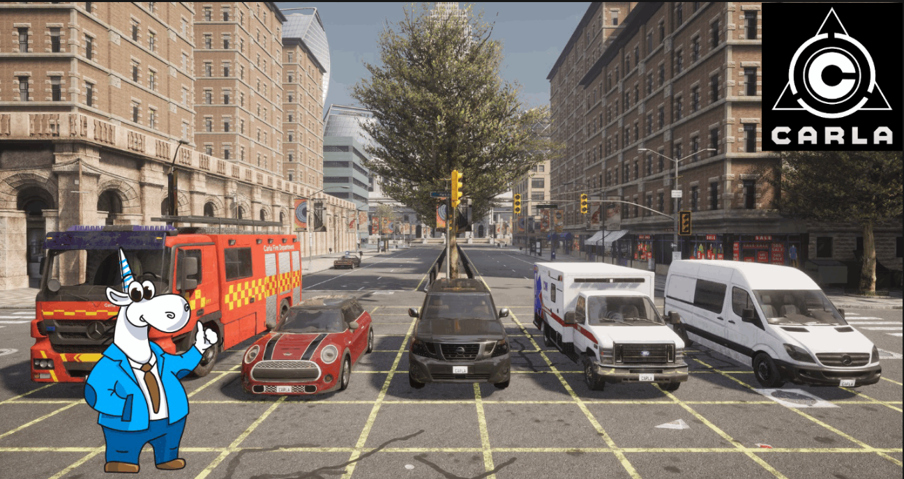

# 🚗 CARLA Parallel Clients

Параллельное управление множеством клиентов в симуляторе CARLA для масштабируемых экспериментов.

## 📹 Демонстрация

1. **Максимальная нагрузка сцен**  
     
   Показывает, как система справляется с одновременным запуском большого числа клиентов на одной сцене.

2. **Ручное управление с другого ПК**  
     
   Демонстрация управления клиентами из удалённого терминала.

## 🔥 Особенности

- **Параллельное** управление N клиентами через Python API
- Автоматическое **распределение** заданий по потокам/процессам
- **Синхронизация** и сбор телеметрии из каждого клиента
- Поддержка **Docker** для воспроизводимости
